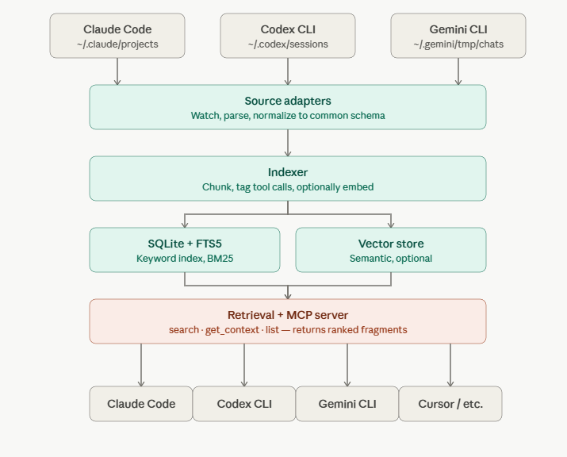

# agent-recall

**Search your past Claude Code, Codex, and Gemini CLI conversations.** Local SQLite + FTS5, exposed via MCP, returns ranked fragments so your next agent doesn't blow its context resuming whole sessions.

> Fork of [akatz-ai/cc-conversation-search](https://github.com/akatz-ai/cc-conversation-search) — extended from a Claude-only resume helper into a multi-CLI fragment-retrieval MCP server. See [Current state](#current-state) for what works today versus what's planned.

## Why this exists

Modern coding CLIs already auto-save every session to disk:

- **Claude Code** → `~/.claude/projects/<proj>/<session>.jsonl`
- **Codex CLI** → `~/.codex/sessions/YYYY/MM/DD/rollout-*.jsonl`
- **Gemini CLI** → `~/.gemini/tmp/<project_hash>/chats/`

That's gigabytes of high-signal text sitting on your filesystem — user prompts, assistant responses, tool calls, tool outputs, reasoning, token usage. None of the official tools let you search across them, and switching between CLIs means losing track of what you figured out where.

`agent-recall` indexes all three into one local SQLite database and serves it over MCP, so any MCP-compatible client (Claude Code, Codex, Gemini CLI, Cursor) can search the union.

## How it's different from "AI memory" tools

There's a crowded space of MCP memory servers — Mem0, MemMachine, MemPalace, mcp-memory-keeper, [mnardit/agent-recall](https://github.com/mnardit/agent-recall) (different project, same name — see [A note on the name](#a-note-on-the-name)), and others. They share one design choice that doesn't fit this problem:

> The agent must actively *save facts* via tool calls during conversations.

That works for curated knowledge ("Alice is the lead engineer at Acme, prefers async") but it doesn't help you find "that session three weeks ago where I finally got the Cloudflare Modbus polling working." For that you need the raw transcript, not a summary the model decided to extract.

This project takes the opposite approach:

| | Knowledge-graph memory tools | agent-recall (this project) |
|---|---|---|
| Source of truth | What the agent saves via tools | Existing JSONL on disk |
| Granularity | Structured entities + slots + relations | Message-level fragments |
| Compliance-dependent | Yes — agent must call save-tools | No — passive indexing |
| Captures history before install | No | Yes, full backfill |
| Right question | "Who is Alice?" | "Find the session where I debugged X" |

The two approaches are complementary. You can run both. This project fills the gap nobody else is filling.

## Principles

1. **Read, don't write.** The CLIs already auto-save. We index what's there. We never ask the agent to do extra work mid-conversation.
2. **Fragments over sessions.** A search returns the relevant ~200 tokens with metadata, not "here's a 40k-token session — resume it." Resume is a separate, explicit tool.
3. **Local, single file.** SQLite. No daemons by default, no cloud, no Neo4j, no Docker. Lives next to your shell history.
4. **Pluggable adapters.** One source = one ~80-line adapter implementing a tiny interface. Adding a new CLI is a weekend, not a fork.
5. **Schema-agnostic ingest, common schema at query time.** Each CLI's quirks get absorbed by its adapter; everything downstream sees the same `Message` shape.
6. **MCP-native.** Any MCP-compatible client gets the same `search` / `get_context` / `list` tools. No client-specific skill code.
7. **Fail open.** If one adapter breaks on a new CLI release, the other two keep serving. Log, don't crash.

## Target architecture



### Tools the MCP server will expose

- **`search(query, source?, date_range?, k=5)`** → ranked fragments: `{source, session_id, project_path, ts, role, snippet, message_uuid}`. The default tool — returns the relevant text, not a resume command.
- **`get_context(session_id, message_uuid, window=10)`** → surrounding messages for a single hit, when one fragment isn't enough.
- **`list(date_range?, source?)`** → conversation-level summaries. This is where resume hints live — explicit, opt-in, not the default.

## Current state

Honest snapshot of where the code is right now:

- ✅ **Claude Code and Gemini indexing works.** Inherited FTS5 indexing from original fork and added Gemini CLI adapter.
- ✅ **MCP server is exposed.** Available via `agent-recall-mcp`. Exposes `search`, `get_context`, and `list` via stdio for any MCP client.
- ✅ **Package and CLI renamed to `agent-recall`.** Fully rebranded from the original fork.
- ✅ **Claude Code skill is MCP-first.** Calls MCP tools directly (CLI as fallback), returns ranked fragments by default, surfaces resume hints only when explicitly asked.
- 🟡 **Codex adapter not yet built.**

If you want to use it today on Claude Code only, the [Quick start](#quick-start) and [Command reference](#command-reference) below describe what works. The rest is roadmap.

## Quick start

```bash
# Install from source
git clone https://github.com/laurynas-pliuskys/agent-recall.git
cd agent-recall
pip install -e .

# Initialize the database (indexes the last 7 days of conversations)
agent-recall init
```

### Wire up Claude Code (one-time setup)

```bash
# Install the skill (Claude Code reads it as a slash-command trigger)
agent-recall install-skill

# Register the MCP server globally
agent-recall configure-mcp

# For Gemini CLI MCP (optional)
agent-recall configure-mcp --target gemini
```

`install-skill` bundles the skill with the package, so this works the same way after `uv tool install agent-recall` once it's on PyPI.

### Basic usage

```bash
# Search
agent-recall search "authentication bug"
agent-recall search "react hooks" --date yesterday
agent-recall search "auth" --since 2025-11-10 --until 2025-11-13

# List by date
agent-recall list --date yesterday
agent-recall list --since "2025-11-01"

# Relative time still works
agent-recall search "query" --days 30

# Resume hint for a specific message
agent-recall resume <MESSAGE_UUID>
```

### MCP server (for Codex, Cursor, and other MCP clients)

Start the MCP server via stdio:

```bash
agent-recall-mcp
```

Or configure it automatically with `agent-recall configure-mcp [--target claude|gemini]`.

The server exposes three tools: `search`, `get_context`, `list_conversations`.
It runs `agent-recall index` automatically on startup to ensure fresh data.

### SessionStart hook (optional, belt-and-suspenders)

To index at the start of every Claude Code conversation (before the MCP server
is ready), add a `SessionStart` hook to `.claude/settings.json`:

```json
{
  "hooks": {
    "SessionStart": [
      {
        "matcher": "",
        "hooks": [
          {
            "type": "command",
            "command": "agent-recall index --quiet"
          }
        ]
      }
    ]
  }
}
```

Indexing is incremental — it only processes new content since the last run,
so this adds only a few seconds on each session start.

### From inside Claude Code (with the skill installed)

Ask Claude naturally:

- *"Find that conversation where we discussed the Cloudflare Modbus integration."*
- *"What did we work on yesterday?"*
- *"Summarize this week's sessions on the rosemary repotting."*

The skill calls the MCP server, returns ranked message fragments by default, and shows resume commands only when you explicitly ask to go back to a session.

## Command reference

### `agent-recall init`

Initialize the database and perform initial indexing.

```bash
agent-recall init [--days 7] [--force]
```

### `agent-recall index`

JIT index conversations (instant, no AI calls). The skill always runs this before `search` for fresh data.

```bash
agent-recall index [--days N] [--all]
```

### `agent-recall search`

```bash
# Relative time
agent-recall search "query" [--days N] [--project PATH] [--content] [--json]

# Calendar dates
agent-recall search "query" --date yesterday [--json]
agent-recall search "query" --date 2025-11-13 [--json]
agent-recall search "query" --since 2025-11-10 --until 2025-11-13 [--json]
```

`--days` cannot be combined with `--date` / `--since` / `--until`. Date formats: `YYYY-MM-DD`, `yesterday`, `today`.

### `agent-recall context`

Get surrounding context around a specific message.

```bash
agent-recall context MESSAGE_UUID [--depth 5] [--content] [--json]
```

### `agent-recall list`

List recent conversations with calendar date support.

```bash
agent-recall list [--days 7] [--limit 20] [--json]
agent-recall list --date yesterday [--json]
agent-recall list --since 2025-11-10 --until today [--json]
```

### `agent-recall tree`

View conversation tree structure for a session.

```bash
agent-recall tree SESSION_ID [--json]
```

## Programmatic API

```python
from agent_recall.core.search import ConversationSearch
from agent_recall.core.indexer import ConversationIndexer

search = ConversationSearch()

# Relative time
results = search.search_conversations("authentication", days_back=7)

# Calendar dates
results = search.search_conversations("authentication", date="yesterday")
results = search.search_conversations("auth", since="2025-11-10", until="2025-11-13")

for r in results:
    print(f"{r['message_uuid']}: {r['summary']}")

# List conversations by date
convs = search.list_recent_conversations(date="yesterday")
convs = search.list_recent_conversations(since="2025-11-10", until="today")

# Re-index
indexer = ConversationIndexer()
indexer.index_new(days_back=7)
indexer.close()
```

JSON output (`--json` flag) is supported on every command for scripting:

```bash
agent-recall search "authentication" --json > auth.json
agent-recall list --days 30 --json | jq '.[] | .conversation_summary'
```

## Source-specific adapter notes

Claude and Gemini adapters are implemented. Codex is still pending. Known quirks per source:

### Claude Code

- **Sidecar tool outputs**: large tool results are persisted to `~/.claude/projects/<proj>/tool-results/<tool_use_id>.txt` and the JSONL line only contains a 2KB preview wrapped in `<persisted-output>` tags. The adapter must detect the wrapper and substitute the full sidecar content.
- **Defensive parsing**: a known bug ([anthropics/claude-code#23948](https://github.com/anthropics/claude-code/issues/23948)) sometimes duplicates the full output in both places — dedupe.
- **Schema isn't officially documented yet** ([anthropics/claude-code#53516](https://github.com/anthropics/claude-code/issues/53516)). Crib from community parsers: `claude-code-log`, `claude-JSONL-browser`, `lm-assist`.
- **Thinking blocks**: index `thinking` content — that's often where the actual reasoning lives.

### Codex CLI

- **Use the official schema dumper** instead of reverse-engineering:

  ```bash
  codex app-server generate-internal-json-schema --out ./codex-schema.json
  ```

  Reference type: `RolloutLine`. Generate a typed parser with `datamodel-code-generator`.

- **`--ephemeral`** sessions aren't persisted — out of scope for the indexer.
- **`/compact` and `thread/rollback`** rewrite the rollout in place. Incremental indexer must re-parse the whole file on detection rather than tail.

### Gemini CLI

- **Auto-save only landed in v0.20.0 (Dec 2025)** — older sessions only exist if user explicitly ran `/chat save <tag>`.
- **Retention pruning is on by default.** Set in `~/.gemini/settings.json`:

  ```json
  { "general": { "sessionRetention": { "enabled": true, "maxAge": "365d", "maxCount": 1000 } } }
  ```

- **Format is less stable than Claude/Codex** — the adapter should be lenient: tolerate missing fields, version the parser, log unknown record types rather than crash.

## Roadmap

### v1 — must

1. ✅ Refactor parser into a pluggable `BaseAdapter` interface + `ParsedMessage` dataclass.
2. 🟡 Add `ClaudeAdapter`, `CodexAdapter`, `GeminiAdapter` (~80 LoC each). (Codex still missing)
3. ✅ Add `source` column to the schema; rebuild FTS5; migration.
4. ✅ Wrap `ConversationSearch` in an MCP server (stdio transport, `mcp` Python SDK). Tools: `search` (fragment-first), `get_context`, `list`.
5. ✅ Update the Claude Code skill to call MCP and return fragments by default. Resume hints are opt-in.
6. ✅ Per-source resume hint helpers: `cd <proj> && claude --resume <sid>`, `cd <proj> && gemini --resume` (browser picker).
7. ✅ Rename CLI binary to `agent-recall`.

### v2 — nice to have

- Filesystem watcher (`watchdog`) for live indexing instead of JIT.
- Hybrid retrieval: FTS5 + local embeddings via Ollama (`nomic-embed-text`), stored with the `sqlite-vec` extension. Score = `α·BM25 + (1-α)·cosine`.
- Smart chunking for long assistant messages (~300-token semantic chunks) rather than storing the full raw message as one FTS document.
- Tool-call-aware indexing: separate `tool_name` / `tool_args_json` columns so "the Cloudflare Modbus integration" matches tool args.
- Session-start AI briefing (inspired by [mnardit/agent-recall](https://github.com/mnardit/agent-recall)): an LLM-generated digest of recent activity injected on `SessionStart`.
- Optional cross-encoder reranker on top-k.

### Out of scope

- Web UI / dashboard.
- Conversation analytics (topics, frequency).
- Cross-machine sync.

## Architecture

Source files on disk, indexed into a single local database:

```
~/.claude/
└── projects/
    └── {project}/
        └── {session}.jsonl

~/.gemini/
└── tmp/
    └── {project_hash}/
        └── chats/
            └── {session}.json

~/.agent-recall/
└── index.db          # SQLite database with FTS5 over indexed messages
```

### Database schema

- **messages**: individual messages, full content, tree structure (`parent_uuid`), timestamps, `source` column (claude/gemini).
- **conversations**: session metadata with summaries, per-source.
- **message_content_fts**: FTS5 virtual table over `full_content`.

### How it works

1. **Indexer**: scans `~/.claude/projects/` and `~/.gemini/tmp/` via pluggable adapters, parses tree structure.
2. **Full content storage**: complete message text is stored and indexed; no truncation at index time.
3. **Meta-conversation filtering**: excludes conversations where the agent used agent-recall itself (prevents recursive pollution).
4. **Search**: FTS5 snippet extraction over full content with conversation tree traversal for context expansion.
5. **JIT indexing**: MCP server and skill both run `index` before `search` for fresh data — no API calls, no delays.
6. **Local timezone display**: all timestamps converted to the local timezone for readability.

## Performance

- **Indexing speed**: ~1000+ messages/second (no API latency).
- **Storage**: ~1-2 KB per message (extracted text + metadata).
- **Search speed**: SQLite FTS5 stays fast at 100K+ messages.
- **Cost**: $0 — no AI API calls during indexing.

## Configuration

Database lives at `~/.agent-recall/index.db`. No config file — everything via command-line flags.

## Development

```bash
git clone https://github.com/laurynas-pliuskys/agent-recall.git
cd agent-recall
pip install -e .
pytest tests/
```

### Project structure

```
agent-recall/
├── src/
│   └── agent_recall/
│       ├── cli.py                  # unified CLI (agent-recall)
│       ├── mcp_server.py           # stdio MCP server (agent-recall-mcp)
│       ├── adapters/
│       │   ├── base.py             # ParsedMessage + BaseAdapter
│       │   ├── claude.py
│       │   └── gemini.py
│       ├── core/
│       │   ├── indexer.py          # drives the adapter list
│       │   ├── search.py           # source filter + fragment-first output
│       │   ├── date_utils.py
│       │   └── summarization.py
│       ├── skill/
│       │   ├── SKILL.md            # bundled Claude Code skill (install-skill copies this)
│       │   └── REFERENCE.md
│       └── data/
│           └── schema.sql
├── .github/
│   └── workflows/
│       └── ci.yml                  # pytest on push/PR
├── scripts/
│   └── bump-version.sh
├── tests/
├── pyproject.toml
└── README.md
```

## Troubleshooting

**"Database not found"**

```bash
agent-recall init
```

**"No conversations found"**

- Verify `~/.claude/projects/` exists and contains JSONL files.
- Use Claude Code to create some conversations first.

**Skill not activating in Claude Code**

- Check skill location: `ls ~/.claude/skills/agent-recall/SKILL.md` (run `agent-recall install-skill` if missing)
- Verify YAML frontmatter format.
- Restart Claude Code.
- Try an explicit trigger: *"Search my conversations for X."*

## Contributing

Issues and PRs welcome. Useful areas (most of these are also on the [Roadmap](#roadmap)):

- Codex or Gemini adapter implementations.
- Semantic search via `sqlite-vec` + Ollama.
- Web UI for conversation tree visualization.
- Export conversation branches as Markdown.
- Conversation analytics (topics, frequency).

## A note on the name

There's an unrelated project by [mnardit](https://github.com/mnardit) also named [`agent-recall`](https://github.com/mnardit/agent-recall). That one is a knowledge-graph memory server in the same family as Mem0 / MemMachine — agents actively push curated facts via MCP tools. This project does the opposite: it passively indexes the raw transcripts the CLIs already save. The two are complementary and can plausibly run side by side. Choose this one when you want to search what was actually said; choose that one when you want a structured knowledge graph the agent curates as it works.

## Acknowledgements

Forked from [akatz-ai/cc-conversation-search](https://github.com/akatz-ai/cc-conversation-search) — the original Claude-only ancestor and the source of the JIT-indexing-into-FTS5 pattern. The planned session-start AI briefing is inspired by [mnardit/agent-recall](https://github.com/mnardit/agent-recall).

## License

MIT
