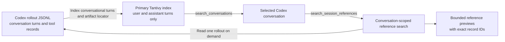

# Agent Recall

**CLI + MCP service for searching Claude Code and Codex conversation history.**

A single binary that works two ways:
- **CLI**: Search your conversations from the terminal (`agent-recall search "rust async"`)
- **MCP Server**: Lets Claude Code and Codex search conversation history during sessions

Other tools are *viewers* - you browse manually. This tool builds a focused Tantivy/BM25 conversation index and gives both you AND AI agents direct search access, while retaining source-backed technical references for focused follow-up.


## Perfect For Heavy AI Agent Users

If you work across **dozens of projects**, you know the pain:
- "I solved this exact problem last month... but which project?"
- "What was that regex pattern I used for parsing logs?"
- "How did I configure that Docker setup?"

This tool indexes **Claude Code and Codex conversations across all projects** and lets your agent search them instantly. No more digging through folders or re-explaining context.

> **Warning**: Claude Code auto-deletes old conversations! Check `~/.claude/settings.json` for `cleanupPeriodDays` - this deletes conversations older than N days (0 = immediate deletion!). Set it to `999999999` to keep your history.

## Why This Tool?

| Feature | Agent Recall | Other Tools |
|---------|--------------|-------------|
| AI agents search history | ✓ MCP integration | ✗ Manual browsing only |
| Cross-project search | ✓ All projects indexed | ✗ Per-project only |
| Full-text search | ✓ Tantivy/BM25 | Some have regex |
| Jump to specific message | ✓ `center_on` + `-B/-A` context | ✗ |
| Technical evidence | ✓ Codex references searched after conversation selection; Claude evidence remains capped in the primary index | Varies |
| Passive staleness detection | ✓ Warns when index outdated | ✗ |

## Overview

`agent-recall` indexes Claude Code and Codex transcript histories and exposes search via MCP so agents can find relevant past conversations during a later session. For Codex, user-visible turns enter the primary index while tool calls/results remain only in the original rollout and are searched after selecting a conversation. Claude tool evidence retains the inherited capped-index behavior for now. System/developer instructions, injected runtime context, mirrored events, and Codex reasoning records are excluded.

## Features

### 🔍 **Powerful Search**
- **Full-text search** across all conversations with BM25 ranking
- **Smart filtering** by project name
- **Highlighted snippets** showing matched content in context
- **Relevance scoring** for best matches first

### ⚡ **High Performance**  
- **Lightning fast**: Sub-millisecond search queries
- **Efficient indexing**: Processes thousands of conversations in seconds
- **Memory efficient**: Uses memory-mapped indexes via Tantivy

### 🔧 **Unified Interface**
- **Single binary** with subcommands for both CLI and MCP server functionality
- **CLI mode**: Simple command-line interface for terminal usage (`agent-recall search ...`)
- **MCP server mode**: Integration with Claude Code and Codex via Model Context Protocol (`agent-recall mcp`)
- Configurable result limits and project-based filtering

### 🎯 **Smart Features**
- **Auto-discovery** of Claude Code (`~/.claude/projects/`) and Codex (`$CODEX_HOME/sessions/` and `archived_sessions/`) transcripts
- **Two-tier Codex evidence retrieval**: Keeps the primary conversation index focused while preserving full textual tool references in the original rollout for conversation-scoped search
- **Source-qualified identity**: Prevents same-looking Claude and Codex session/message IDs from colliding
- **Passive health monitoring**: Warns when index is stale, offers reindex tool
- **Robust parsing** handles malformed JSONL gracefully

## Quick Start

### Installation

```bash
cargo build --release
cp target/release/agent-recall ~/.local/bin/
# Registers the user-scoped Claude Code MCP server.
agent-recall install
# Register the same stdio server with Codex.
codex mcp add agent-recall -- ~/.local/bin/agent-recall mcp
```

`agent-recall install` currently registers **Claude Code only**. It does not
modify Codex configuration.

Verify the registrations sequentially (each client may start the server while
checking it):

```bash
claude mcp get agent-recall
claude mcp list
codex mcp get agent-recall
codex mcp list
```

### Basic Usage

```bash
# Index your conversations (run this first time)
agent-recall index

# Search for anything
agent-recall search "kubernetes"
agent-recall search "error handling"
agent-recall search "rust async"

# Search with project filter
agent-recall search "rust" --project "vault-rs"

# Limit number of results
agent-recall search "function" --limit 20

# After selecting a Codex session, search its source-backed tool references
agent-recall references <session-id> "SELECT access_method"
```

## CLI Reference

### `agent-recall index`
Build or update the search index.

```bash
agent-recall index              # Build/update index
agent-recall index rebuild      # Force full rebuild (recreates index)
```

**What it does:**
- Scans Claude Code and Codex transcript directories for `*.jsonl` files
- Parses conversation entries with timestamps, content, and metadata
- Builds full-text search index using Tantivy
- Index stored at `~/.cache/agent-recall/`

### `agent-recall search <query>`
Search through your indexed conversations.

```bash
agent-recall search "rust async functions"
agent-recall search "error" --project "my-project" --limit 5
```

**Options:**
- `--project <name>` - Filter by project directory name (e.g., "vault-rs")
- `--limit <n>` - Maximum results to show (default: 10)

**Query features:**
- **Simple text**: `agent-recall search "docker compose"`
- **Multiple terms**: `agent-recall search "rust error handling"`
- **Phrase search**: `agent-recall search '"exact phrase"'` (wrap in quotes)
- **Boolean AND**: `agent-recall search "rust AND async"` (both terms must appear)

## MCP Integration

This tool provides an MCP (Model Context Protocol) server for seamless integration with Claude Code and Codex.

### Setup

1. **Build the binary**:
   ```bash
   cargo build --release
   ```

2. **Configure Claude Code**:
   ```bash
   # Convenience command: registers Claude Code at user scope only.
   agent-recall install

   # Or, instead of the command above, register Claude Code explicitly.
   claude mcp add -s user agent-recall ~/.local/bin/agent-recall mcp
   ```

3. **Configure Codex**:
   ```bash
   codex mcp add agent-recall -- ~/.local/bin/agent-recall mcp
   ```

   `agent-recall install` does not register Codex, so run the Codex command
   separately. The explicit `mcp` argument starts the MCP server mode.

4. **Verify one client at a time**:
   ```bash
   claude mcp get agent-recall
   codex mcp get agent-recall
   ```

5. **Use within sessions**:
   - "Search my previous conversations about Rust async"
   - "Find where we discussed error handling"

### MCP Tools Available
- **search_conversations**: Full-text search with `-C`/`-B`/`-A` context (grep-style).
- **search_session_references**: Search source-backed tool calls/results within one selected Codex conversation.
- **get_session_messages**: Paginated session content.
- **get_messages**: Fetch full content of specific messages.
- **summarize_session**: Returns Task instructions for session summarization.
- **reindex**: Update index when results seem incomplete.
- **respawn_server**: Reload MCP server after rebuilding.

### Context-efficient retrieval

Use retrieval in stages so a long transcript does not consume the model's context:

1. `search_conversations` returns one compact match per conversation with short surrounding-message previews.
2. For Codex technical evidence, `search_session_references(session_id=..., query=...)` scans only that conversation's original rollout and returns bounded tool-reference previews.
3. `get_session_messages(source="codex", session_id=..., center_on=..., -C=0, include=["tools"], truncate_length=0)` expands one exact Codex reference. For ordinary conversational context, omit `include=["tools"]`.
4. `get_messages(ids=[...], source=..., session_id=...)` retrieves exact records that are present in the primary index. Codex tool references are intentionally absent from that index.
5. Use paginated session reads only when the focused fragment is insufficient; `truncate_length=0` explicitly requests full message content.

### Codex conversation index versus references

Codex tool payloads are evidence, but they are not normally good global discovery text: large command output can distort ranking, duplicate sensitive data into the index, and increase its size. Agent Recall therefore keeps Codex discovery and technical inspection separate.


```mermaid
flowchart LR
    R["Codex rollout JSONL<br/>conversation turns and tool records"]
    I["Primary Tantivy index<br/>user and assistant turns only"]
    C["Selected Codex conversation"]
    S["Conversation-scoped reference search"]
    E["Bounded reference previews<br/>with exact record IDs"]

    R -->|"Index conversational turns and artifact locator"| I
    I -->|"search_conversations"| C
    C -->|"search_session_references"| S
    S -->|"Read one rollout on demand"| R
    S --> E
```

The original JSONL remains the full-fidelity technical record and the filesystem remains its security boundary. Reference search does not create a second technical index or persistent copy: it reparses one selected artifact and searches it in memory. This reduces index storage and prevents canonical tool payloads from influencing global BM25 ranking. Known synthetic approval transcripts that mirror tool arguments inside injected user-shaped messages are excluded as runtime context as well.

The tradeoff is deliberate: an exact table name, command, or error that appears only in a Codex tool record cannot locate its conversation through global search. First find the conversation using its topic, decision, project, or user/assistant wording; then search its references. Claude still indexes capped tool inputs/results and will be migrated separately if this Codex design proves useful.

## Configuration

### Config File

`~/.config/agent-recall/config.yaml`:

```yaml
limits:
  per_file_chars: 150000
  tool_result_max_chars: 2000   # Claude tool-result preview indexed per block
  tool_input_max_chars: 200     # Claude tool-input preview indexed per block

search:
  exclude_patterns: []          # Regex patterns to exclude from results

index:
  auto_index_on_startup: true
  writer_heap_mb: 50
```

Codex textual tool payloads are not stored in the primary index. They remain in the source rollout and are available through `search_session_references` followed by exact centered retrieval. Non-text media payloads are not exposed as textual references. Changing Claude tool limits requires a reindex (`agent-recall index rebuild`).

### Cache Location

- **Linux**: `~/.cache/agent-recall/`
- **macOS**: `~/Library/Caches/agent-recall/`
- **Windows**: `%LOCALAPPDATA%\agent-recall\`

## Troubleshooting

### Getting Help

```bash
agent-recall --help          # General help
agent-recall search --help   # Search command help
agent-recall index --help    # Index command help
```

## License

GPL-3.0-only - see [LICENSE](LICENSE) for details.
